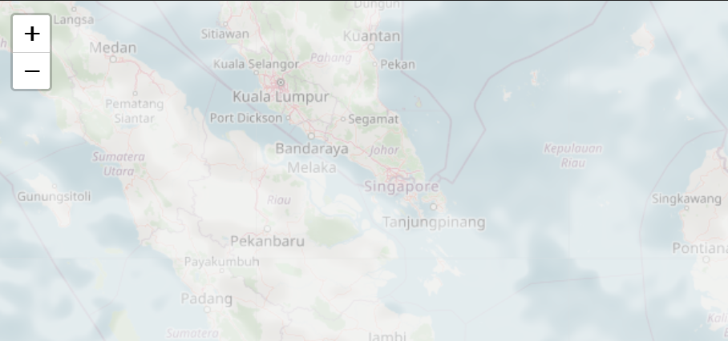
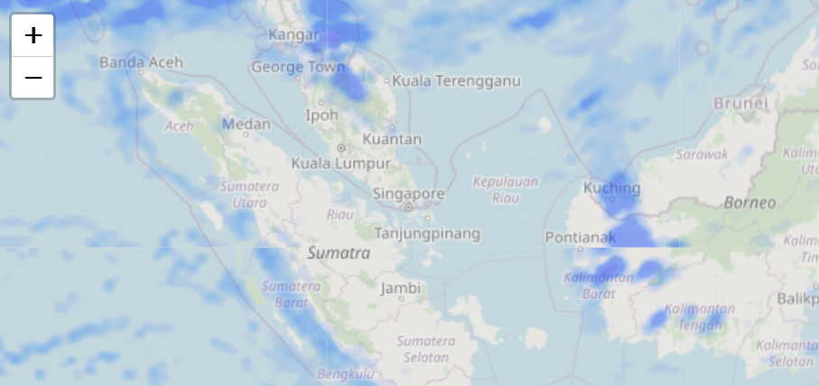
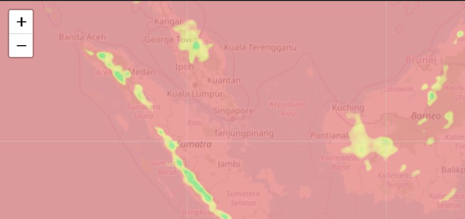
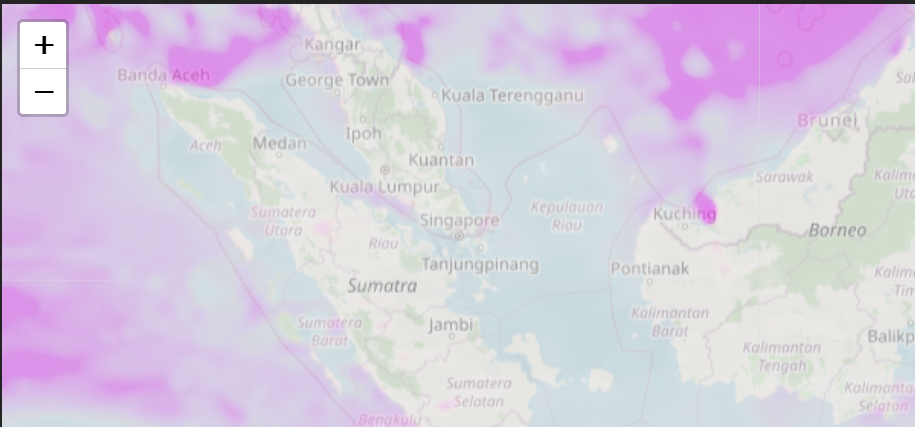
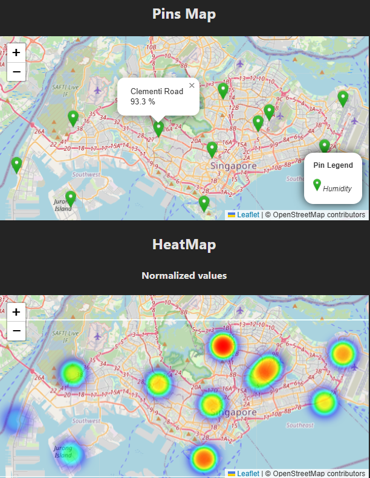
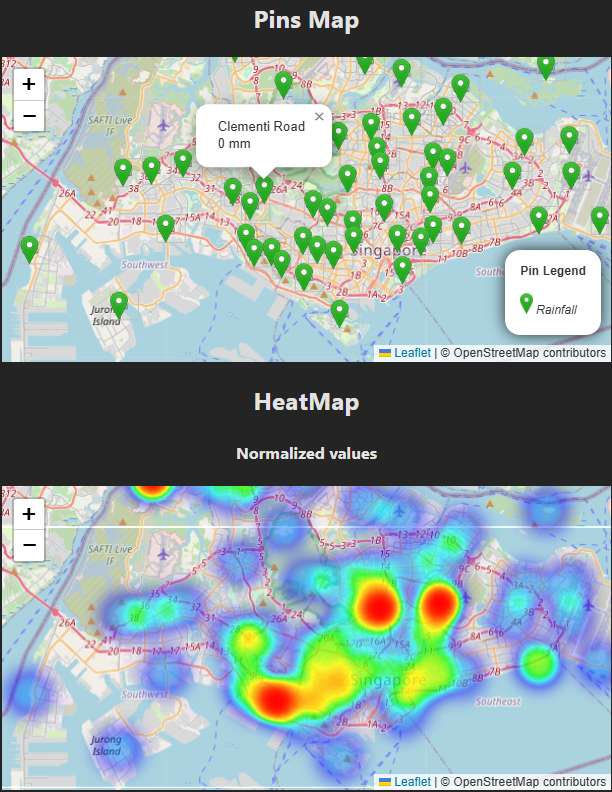
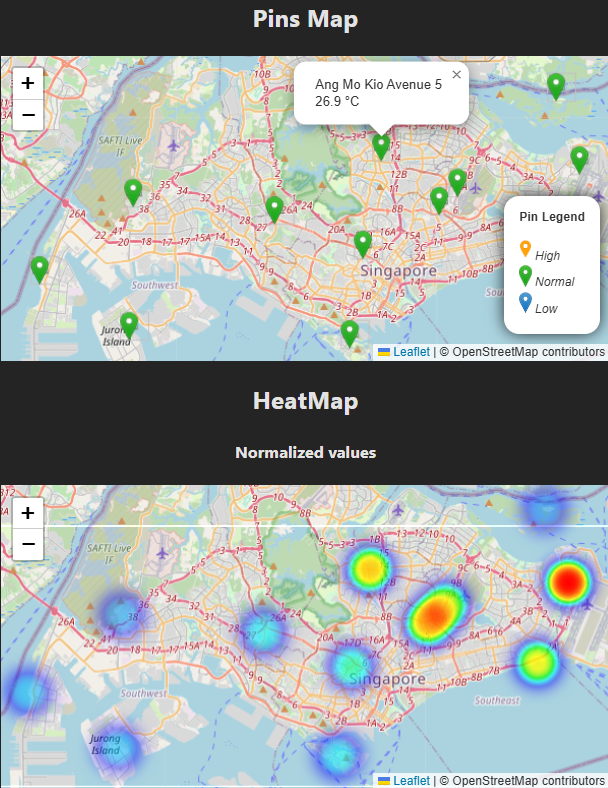
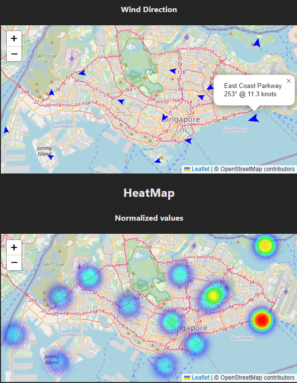

# Introduction
Main goal: To have a holistic view of the weather around SG whether it is using local data or global data

# Implementation
The local view is using api data from https://api-open.data.gov.sg/. The data retrieve is the latest data and returns the readings from the weather stations around SG. Data formatting was performed to fit into the pins map and the heatmap. For the heatmap, it was observed that the raw values are either to small or clamped together in a certain range. Hence normalized was performed within 0.5 to 1 (values less than 0.5 is not very visible) for better understanding of which area are more/less affected. It is to be use together with raw values, as sometime normalized heatmap has no meaning (eg. no rainfall across SG)

The regional data is using api data from https://tile.openweathermap.org, the TileServer script is responsible for retrieve the tile map data from the https://tile.openweathermap.org and enhancing before sending to the client react. The tile map data is then overlay with the map. The pressure map is available, but disable as it affects mostly the northern and southern part of the world.

# Setup
#### Installing node packages
a. Using repo package.json
```
npm install
```

b. Using fresh vite@latest package.json
```
npm install
npm install express cors axios dotenv
npm install sharp
npm install chart.js react-chartjs-2
npm install react-leaflet leaflet leaflet.heat
npm install react-tabs
```

#### Preparing .env file
Creating .env in root folder with the following fields

IMPORTANT: There must be "VITE_" prefix in the names
```
VITE_OPEN_WEATHER_API = <register_openweathermap_api_key_and_fill_in>
VITE_TILE_HOST = <to_fill_in_database_url>
VITE_TILE_PORT = <to_fill_in_tile_port>
```

# Usage
#### Running server
To read from MySQL database and serves API request
```
node ./scripts/TileServer.js
```

#### Running the react client
```
npm run dev
```

# Features Log
1. Added Weather Map viewable by region's point of view

   <u>Cloud Map</u>
   

   <u>Precipitation Map</u>
   

   <u>Temperature Map</u>
   

   <u>Wind Speed Map</u>
   

2. Added Weather Map viewable by local's point of view. Map available in pins map and heatmap.

3. Added normalized heatmap as the raw values are either to small or clamped together in a certain range.
   
   <u>Humidity Map</u>
   

   <u>Rainfall Map</u>
   

   <u>Temperature Map</u>
   

4. Modified wind direction to include arrow head instead of pins

   <u>Wind speed & direction Map</u>
   

3. Modified pins map to include upper and lower threshold and set the rainfall to normalize within 0 to 1. Shown in the above updated images